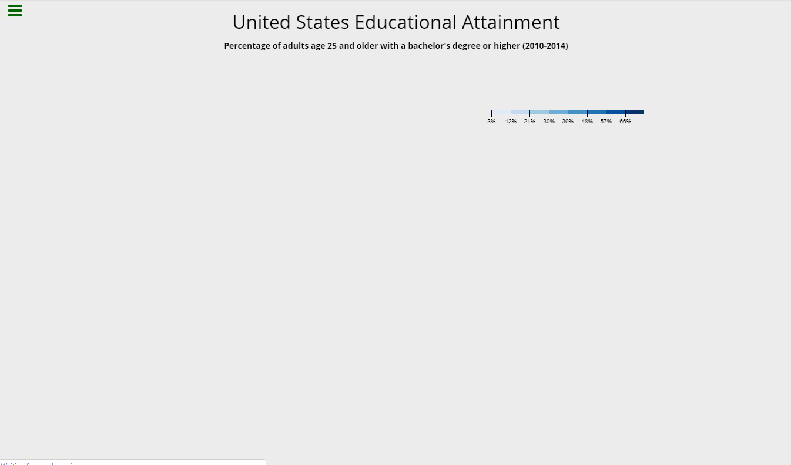

# Visualize Data with a Choropleth Map
### About the project

it's a freecodecamp project in the "Data Visualization Projects" module, you have to Visualize Data with a Choropleth Map.

### Tools used

**Front-end:** D3

### Screenshot



### Link

https://codepen.io/B-Tarik/full/pYeOWG

### User stories

1. My choropleth should have a title with a corresponding ```id="title"```.
2. My choropleth should have a description element with a corresponding ```id="description"```.
3. My choropleth should have counties with a corresponding ```class="county"``` that represent the data.
4. There should be at least ```4``` different fill colors used for the counties.
5. My counties should each have ```data-fips``` and ```data-education``` properties containing their corresponding ```fips``` and ```education``` values.
6. My choropleth should have a ```county``` for each provided data point.
7. The counties should have ```data-fips``` and ```data-education``` values that match the sample data.
8. My choropleth should have a legend with a corresponding ```id="legend"```.
9. There should be at least ```4``` different fill colors used for the legend.
10. I can mouse over an area and see a tooltip with a corresponding ```id="tooltip"``` which displays more information about the area.
11. My tooltip should have a ```data-education``` property that corresponds to the ```data-education``` of the active area.